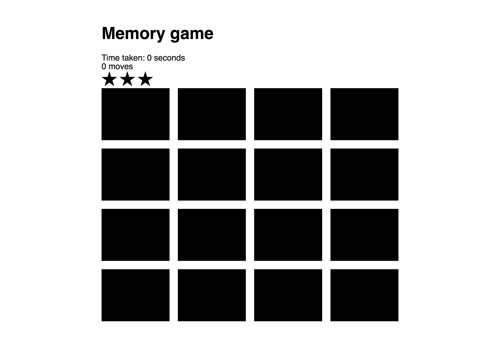

## Memory Game
Also know as Concentration game, is a game where you flip two random cards and see if they match. You flip the cards until you guess every pair of card correctly.

## Motivation
This was built as a project of the Udacity Frontend Nanodegree to help demonstrate my Javascript skills.

## How to Play?
- Turn over any two cards.
- If the two cards match, you've made a correct guess.
- If they don't match, you've made a wrong guess.
- Try to remember what was on each card and where it was if you made a wrong guess.
- The game is won when all the cards have been matched.

## Code style
Udacity [style guide](http://udacity.github.io/frontend-nanodegree-styleguide/index.html)

## Screenshots

## Tech/framework used
Vanilla Javascript

## Future features

- choose a different stack of cards. I.e football logos, car logos, fashion logos
- a leaderboard
- multiple players

## Credits
Thanks to Udacity for their awesome Front end Nanodegree